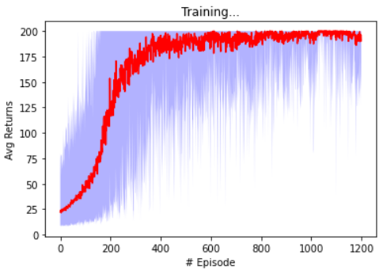
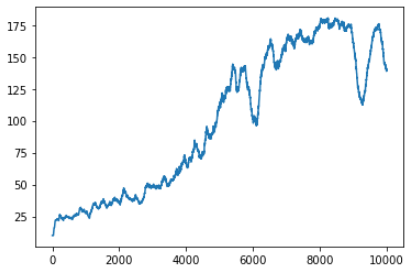
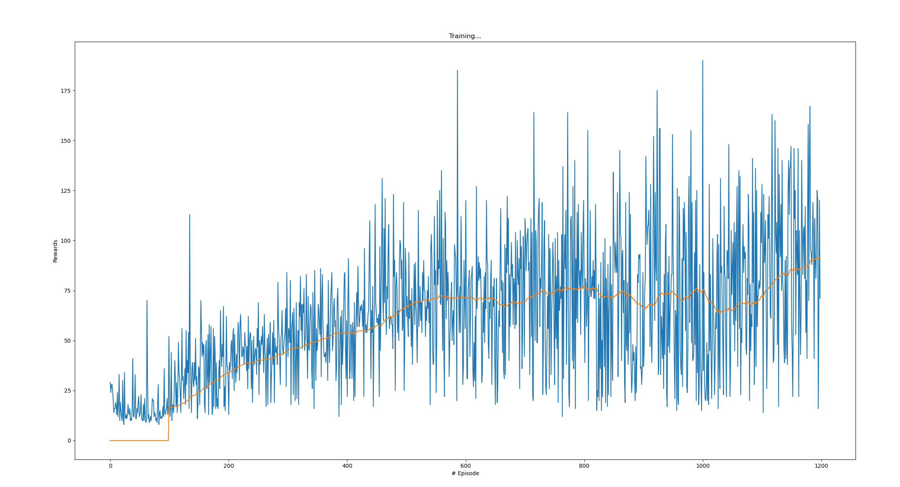
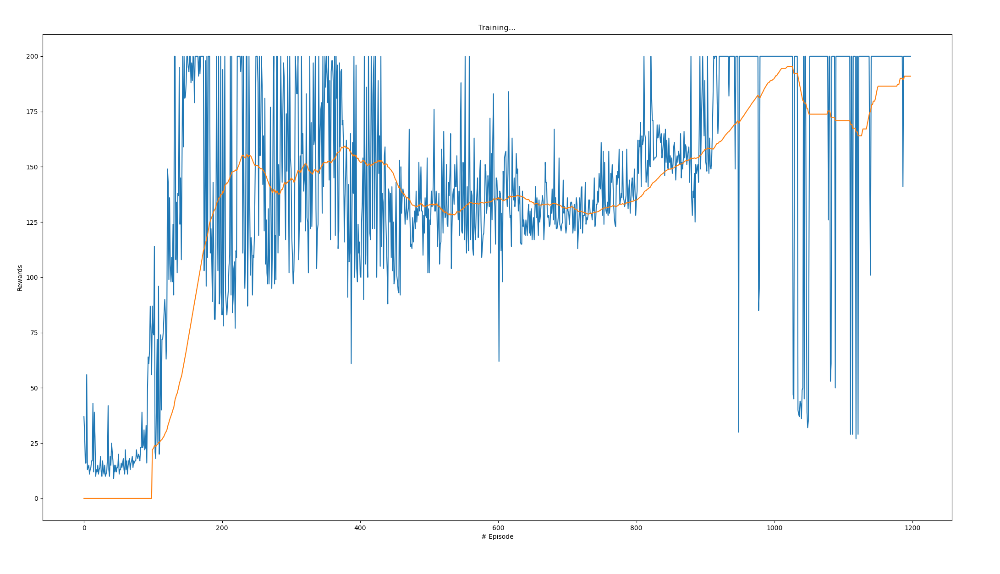

# Deep Reinforcement Learning Algorithms

The intersection between Deep Learning (usage of Deep Neural Networks) and Reinforcement Learning settings. Here, the DNN's role is either/both to approximate value functions (input: observations/observations and actions, output: scalar translating the expectations of the long-term returns of the input) or/and to estimate directly the distribution of the action space (policy) from observations. The algorithms clustering presented here (policy gradient methods, q-learning methods and explicit actor-critic - hybrid) is based on [spinninup notes](#https://spinningup.openai.com/en/latest/spinningup/rl_intro2.html).

## Policy gradient methods

* Estimate of the gradient of the policy's performance w.r.t. the respective policy parameters
* **Score Function Estimator** is a general method for estimating gradients of expectations: $\nabla_\theta E_x[f(x)] = E_x [\nabla_\theta \log p(x|\theta) f(x)]$. In Deep RL setting, let's say that $x$ is a random variable (the state or trajectory) and $f(x)$ the function that maps the state\trajectory to a reward, then: $\nabla_\theta E_\tau[R(\tau)] = E_\tau [\nabla_\theta \log p(\tau|\theta) R(\tau)]$, which with a little manipulation (chain rule in the trajectory) is the same as:  $\nabla_\theta E_\tau[R(\tau)] = E_\tau [\sum^{T-1}_{t=0}\nabla_\theta \log \pi(a_t|s_t, \theta) R(\tau)]$
* If the reward is high, we want to move the parameters in order to increase the log likelihood of that trajectory
* We can reduce the variance of the policy gradient estimator by using a baseline; a near optima choice is the state-value function
* Typically, on-policy methods

### Vanilla Policy Gradient or REINFORCE

* The key idea of Policy Gradients algorithms is to  estimate the gradient of the policy's performance, pushing the probabilities of actions that lead to higher return, and pushing down the probabilities of actions that lead to lower return, until arrive to the optimal policy
* VPG is an on-policy method, i.e. the behavior policy (the one used to generate behavior) is the same as the target policy (the one that we want to estimate)
* Target environments: discrete/continuous
* Instead of state/state-action value functions, this algorithm make use of the advantage (*A*) of a policy over the others;  in practice, it is computed based on the infinite-horizon discounted return, despite the theoretical formulation: $\nabla_\theta J(\pi_\theta) = E_{\tau \sim \pi_\theta} [\sum^{T}_{t=0} \nabla_\theta \log \pi_\theta(a_t|s_t)A^{\pi_\theta}(s_t, a_t)]$, where the advantage is given by $||b(s_t) - R_t||^2$, being $b$ the baseline 
* The exploration/exploitation `tradeoff` in this algorithm is handled through the approximation to stochastic policy
* Over the course of training, the policy typically becomes progressively less random, as the update rule encourages it to exploit rewards that it has already found. This may cause the policy to get trapped in local optima
* Spinning up makes use of Generalized Advantage Estimation for computing the policy gradient, which I actually don't know much about but I think that it's not the most important thing to retain
* [An Official Pseudo-code](https://spinningup.openai.com/en/latest/algorithms/vpg.html#vanilla-policy-gradient) 
* **My understanding** (coarse view):
  * Observation from the environment
  * Observation forward pass through the policy net - policy net returns the `logits` of each possible action; 
  * Sample an action from a distribution of those `logits` (Categorical for discrete and Gaussian for continuous actions)
  * Observation forward pass through the value function net  - value net returns the value of that observation
  * Environmental step that yields the respective reward and the next observation
  * Append to the memory experience buffer the tuple $(o, a, r, v)$; the state value in this case is stored to compute the advantage at the end of the episode
  *  Current observation = next observation
  * If the number max of steps per epoch is reached or the current episode reaches the max trajectory length, we get the value of the current observation and we "bootstrap"
  * if the the epoch/episode finishes, we then compute the advantage function and we store it in the buffer
  * At the end of each epoch:
    * Sample all data from the memory buffer  
    * update the policy net and the value function based on the respective loss functions (here, capital letters mean the full batch):
    * $L_\pi(\theta) = -(\log(\pi(A|O;\theta) \times \text{Adv}).\text{mean()}$
    * $L_{v_{\pi}} = ((V_\pi(s) - R)^2).\text{mean()}$

The results of this algorithm stands for the average return over each epoch and respective minimum and maximum. The first result corresponds to the usage of the default state observations ([`Cart Position, Cart Velocity, Pole Angle, Pole Velocity At Tip]`):

  

| Argument Name      |   Type   |    Default    | Additional Info                         |
| ------------------ | :------: | :-----------: | --------------------------------------- |
| --epochs           |  `int`   |    `1200`     | Number of epochs to train               |
| --steps_per_epoch  |  `int`   |    `4000`     | Number maximum of (s, a) per epoch      |
| --gamma            | `float`  |    `0.99`     | Discount factor (adv. function)         |
| --lam              | `float`  |    `0.97`     | Adv. function hyperparameter            |
| --pi_lr            | `float`  |    `3e-4`     | Learning rate for the policy net        |
| --v_lr             | `float`  |    `1e-3`     | Learning rate for the value function    |
| --train_v_iters    |  `int`   |     `80`      | Number of updates in the value function |
| --max_ep_len       |  `int`   |    `1000`     | Max len of a traj/episode/rollout       |
| --hidden_sizes     | `tuple`  |   `(32,32)`   | Shape of each hidden FC layer           |
| --observation_type | `string` |   `default`   | Choices = [`default`, `img`]            |
| --env              | `string` | `CartPole-v0` | The only one provided right now         |
| --device           | `string` |     `cpu`     | Choices = [`cuda`, `cpu`]               |

The `observation_type` stands out for the types of state observations that the algorithm may have: the input image or the default state observations (position of cart, velocity of cart, angle of pole, rotation rate of pole for the CartPole-v0 environment). In this algorithm, one thing that I'd like to notice is the fact that the full batch is stored before the algorithm's update. In this way, we keep the i.i.d assumption motivated by the usage of Deep Networks (a full epoch has no dependence with the respective next epoch). 

### A3C or Advantage Actor-Critic 

* The key feature of this algorithm is that makes use of parallel training to introduce exploration, speed up and ease the training procedure: by running different actors in different processors

* These actors or their results are synced from time to time 

* The usage of multiple actors enables to drop the limited replay buffer memory (used to stabilize training); the latter is limited in the sense that just allows off-policy settings and resorts a big amount of computational power

* In this way, it makes sense to present and describe some interesting and fundamental concepts w.r.t. concurrency:

  * **Concurrency**

    * Different trains of thought. Each one can be stopped at certain points, and the CPU or brain that is processing them can switch to a different one. The state of each one is saved so it can be restarted right where it was interrupted

      * `multiprocessing` actually runs these trains of thought at literally the same time -> Parallelism
      * `threading` and `asyncio` both run on a single processor and therefore only run one at a time. They just cleverly find ways to take turns to speed up the overall process. Even though they don’t run different trains of thought simultaneously, we still call this concurrency

    * *Threads and Tasks*

      * `threading`: **pre-emptive multitasking** - the OS knows about each thread and can interrupt it at any time to start running a different thread
      * `asyncio`: **cooperative multitasking** - the tasks must cooperate by announcing when they are ready to be switched out; here, we always know when the task will be swapped out

    * *Parallelism and Processes*

      * This allows us to make use of many processors/cores of our CPU -> `multiprocessing`

        Python creates new processes, which can be seen as completely different programs. Bringing up a separate Python interpreter is not as fast as starting a new thread in the current Python interpreter. It’s a heavyweight operation and comes with some restrictions and difficulties, but for the correct problem, it can make a huge difference

    * *Usefulness*

      * I/O bound: wait for input/output (I/O) from some external resource (e.g. Internet requests). These problems arise frequently when your program is working with things that are much slower than your CPU; speeding it up involves overlapping the times spent waiting for these devices. -> Multi-threading/asyncio
      * CPU-bound: most of the time doing CPU operations; speeding it up involves finding ways to do more computations in the same amount of time -> Multi-Processing

The result of this algorithm stands for the a moving average of the returns. It corresponds to the usage of the default state observations ([`Cart Position, Cart Velocity, Pole Angle, Pole Velocity At Tip]`):

  

## Q-Learning methods

* Instead of directly learning the policy, Q-Learning methods learn an optimal state-action ($Q_\theta(s,a)$) value function; from that we can get the optimal policy
* Typically, off-policy methods

### DQN

* The primary goal of this algorithm is to learn a state-action value function whose inputs are RGB images
* One of the possible misconceptions when using Deep Learning in RL settings could be: the i.i.d property of the data. To avoid this problem, DQN stores first the data in  a replay buffer; from which training data is **randomly** sampled
* DQN is an off-policy algorithm in which the action stored in the memory buffer is generated based on a state action network different from the one being estimated
* Therefore, this algorithm makes use of 2 state action value networks: the one that is used to generate data and the other that is consecutively being approximated through the Bellman optimally equation; After `C` episodes, the weights of the estimated network are copied to the behavior state action value model
* See the [official paper](https://www.cs.toronto.edu/~vmnih/docs/dqn.pdf)
* **My understanding** (coarse view):
  * Replay memory initialization
  * Policy network initialization
  * Target policy network initialization (same weights as the previous)
  * For each episode:
    * Environment resetting and starting state initialization
    * For each environment interaction:
      * Select an action (exploration/exploitation)
      * Execute selected action in an emulator
      * Observe reward and next state
      * Store experience in the replay buffer
      * Sample a random batch from the buffer
      * Forward pass of the batch in the policy network -> current Q values
      * Forward pass in the target net -> next Q values
      * Compute target Q values -> $\text{target} = (\text{next}*\gamma)+R$
      * Compute the loss -> diff between target and current 
      * Gradient Descent update in the target policy network
      * After `target_update` steps, we copy the policy network weights to the target policy's weights; this increases the stability training of the target NN

The results of this algorithm stands for a moving average over 100 episodes. The first result corresponds to the usage of images as states observations:

  

The second result is based on default states observations ([`Cart Position, Cart Velocity, Pole Angle, Pole Velocity At Tip]`):

  

**Conclusion:** Images as states observations in this setting take longer to converge/get to an "optimal" value.

| Argument Name      |   Type   |     Default      | Additional Info                       |
| ------------------ | :------: | :--------------: | ------------------------------------- |
| --episodes         |  `int`   |      `1200`      | Number of episodes to train           |
| --batch_size       |  `int`   |      `512`       | Number of experiences sampled         |
| --memory_size      |  `int`   |     `100000`     | Memory buffer capacity                |
| --target_update    |  `int`   |        10        | Episodes step for the synchronization |
| --gamma            | `float`  |       0.99       | Discount factor                       |
| --lr               | `float`  |      `1e-3`      | Learning rate                         |
| --eps_vals         | `tuple`  | `(1,0.01,0.001)` | Exploration setting                   |
| -hidden_sizes      | `tuple`  |    `(32,32)`     | Shape of each hidden FC layer         |
| --observation_type | `string` |      `img`       | Choices = [`default`, `img`]          |
| --env              | `string` |  `CartPole-v0`   |The only one provided right now|
| --device           | `string` |      `cpu`       | Choices = [`cuda`, `cpu`]             |