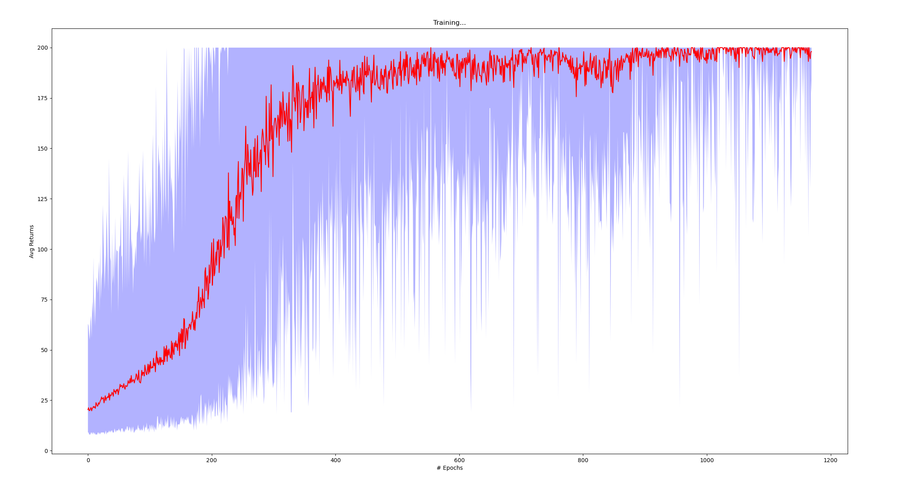

# Deep Reinforcement Learning Algorithms

## Code Template

I opted to use a transversal "code template" for deep RL algorithms based on [deeplizard tutorials](https://deeplizard.com/learn/playlist/PLZbbT5o_s2xoWNVdDudn51XM8lOuZ_Njv) because it is cleaner, reproducible and suitable for debugging. It is mainly composed of these different modules:

* Policy (and target) network(s) and/or state/state-action value functions 
* Experience is a *namedtuple* - e.g. in DQN is $(s,a,s',r)$
*  Replay memory for the algorithms, which make use of it, with the following functions:
  * appending new experiences
  * sampling experiences
  * other functions that can be useful for the respective algorithm
* An object that keeps track of the exploration/exploitation trade-off if off-policy method, when it is the case
* An RL agent  that defines the policy actions or Actor Critic functions 
* Environment Manager is the visual high-level handler of the environment from [Open AI Gym](https://gym.openai.com/) 
* Main loop with the training 

## Policy gradient methods

* Estimate of the gradient of the policy's performance w.r.t. the respective policy parameters
* **Score Function Estimator** is a general method for estimating gradients of expectations: $\nabla_\theta E_x[f(x)] = E_x [\nabla_\theta \log p(x|\theta) f(x)]$. In Deep RL setting, let's say that $x$ is a random variable (the state or trajectory) and $f(x)$ the function that maps the state\trajectory to a reward, then: $\nabla_\theta E_\tau[R(\tau)] = E_\tau [\nabla_\theta \log p(\tau|\theta) R(\tau)]$, which with a little manipulation (chain rule in the trajectory) is the same as:  $\nabla_\theta E_\tau[R(\tau)] = E_\tau [\sum^{T-1}_{t=0}\nabla_\theta \log \pi(a_t|s_t, \theta) R(\tau)]$
* If the reward is high, we want to move the parameters in order to increase the log likelihood of that trajectory
* We can reduce the variance of the policy gradient estimator by using a baseline; a near optima choice is the state-value function
* Typically, on-policy methods

### Vanilla Policy Gradient or REINFORCE

* The key idea of Policy Gradients algorithms is to  estimate the gradient of the policy's performance, pushing the probabilities of actions that lead to higher return, and pushing down the probabilities of actions that lead to lower return, until arrive to the optimal policy
* VPG is an on-policy method, i.e. the behavior policy (the one used to generate behavior) is the same as the target policy (the one that we want to estimate)
* Target environments: discrete/continuous
* Instead of state/state-action value functions, this algorithm make use of the advantage (*A*) of a policy over the others;  in practice, it is computed based on the infinite-horizon discounted return, despite the theoretical formulation: $\nabla_\theta J(\pi_\theta) = E_{\tau \sim \pi_\theta} [\sum^{T}_{t=0} \nabla_\theta \log \pi_\theta(a_t|s_t)A^{\pi_\theta}(s_t, a_t)]$, where the advantage is given by $||b(s_t) - R_t||^2$, being $b$ the baseline 
* The exploration/exploitation `tradeoff` in this algorithm is handled through the approximation to stochastic policy
* Over the course of training, the policy typically becomes progressively less random, as the update rule encourages it to exploit rewards that it has already found. This may cause the policy to get trapped in local optima
* Spinning up makes use of Generalized Advantage Estimation for computing the policy gradient, which I actually don't know much about but I think that it's not the most important thing to retain
* [An Official Pseudo-code](https://spinningup.openai.com/en/latest/algorithms/vpg.html#vanilla-policy-gradient) 
* **My understanding** (coarse view):
  * Observation from the environment
  * Observation forward pass through the policy net - policy net returns the `logits` of each possible action; 
  * Sample an action from a distribution of those `logits` (Categorical for discrete and Gaussian for continuous actions)
  * Observation forward pass through the value function net  - value net returns the value of that observation
  * Environmental step that yields the respective reward and the next observation
  * Append to the memory experience buffer the tuple $(o, a, r, v)$; the state value in this case is stored to compute the advantage at the end of the episode
  *  Current observation = next observation
  * If the number max of steps per epoch is reached or the current episode reaches the max trajectory length, we get the value of the current observation and we "bootstrap"
  * if the the epoch/episode finishes, we then compute the advantage function and we store it in the buffer
  * At the end of each epoch:
    * Sample all data from the memory buffer  
    * update the policy net and the value function based on the respective loss functions (here, capital letters mean the full batch):
    * $L_\pi(\theta) = -(\log(\pi(A|O;\theta) \times \text{Adv}).\text{mean()}$
    * $L_{v_{\pi}} = ((V_\pi(s) - R)^2).\text{mean()}$

  

| Argument Name      |   Type   |    Default    | Additional Info                         |
| ------------------ | :------: | :-----------: | --------------------------------------- |
| --epochs           |  `int`   |    `1200`     | Number of epochs to train               |
| --steps_per_epoch  |  `int`   |    `4000`     | Number maximum of (s, a) per epoch      |
| --gamma            | `float`  |    `0.99`     | Discount factor (adv. function)         |
| --lam              | `float`  |    `0.97`     | Adv. function hyperparameter            |
| --pi_lr            | `float`  |    `3e-4`     | Learning rate for the policy net        |
| --v_lr             | `float`  |    `1e-3`     | Learning rate for the value function    |
| --train_v_iters    |  `int`   |     `80`      | Number of updates in the value function |
| --max_ep_len       |  `int`   |    `1000`     | Max len of a traj/episode/rollout       |
| --hidden_sizes     | `tuple`  |   `(32,32)`   | Shape of each hidden FC layer           |
| --observation_type | `string` |   `default`   | Choices = [`default`, `img`]            |
| --env              | `string` | `CartPole-v0` | The only one provided right now         |
| --device           | `string` |     `cpu`     | Choices = [`cuda`, `cpu`]               |

The `observation_type` stands out for the types of state observations that the algorithm may have: the input image or the default state observations (position of cart, velocity of cart, angle of pole, rotation rate of pole for the CartPole-v0 environment). In this algorithm, one thing that I'd like to notice is the fact that the full batch is stored before the algorithm's update. In this way, we keep the i.i.d assumption motivated by the usage of Deep Networks (a full epoch has no dependence with the respective next epoch). 

## Q-Learning methods

* Instead of directly learning the policy, Q-Learning methods learn an optimal state-action ($Q_\theta(s,a)$) value function; from that we can get the optimal policy
* Typically, off-policy methods

### DQN

* The primary goal of this algorithm is to learn a state-action value function whose inputs are RGB images
* One of the possible misconceptions when using Deep Learning in RL settings could be: the i.i.d property of the data. To avoid this problem, DQN stores first the data in  a replay buffer; from which training data is **randomly** sampled
* DQN is an off-policy algorithm in which the action stored in the memory buffer is generated based on a state action network different from the one being estimated
* Therefore, this algorithm makes use of 2 state action value networks: the one that is used to generate data and the other that is consecutively being approximated through the Bellman optimally equation; After `C` episodes, the weights of the estimated network are copied to the behavior state action value model
* See the [official paper](https://www.cs.toronto.edu/~vmnih/docs/dqn.pdf)
* **My understanding** (coarse view):
  * Replay memory initialization
  * Policy network initialization
  * Target policy network initialization (same weights as the previous)
  * For each episode:
    * Environment resetting and starting state initialization
    * For each environment interaction:
      * Select an action (exploration/exploitation)
      * Execute selected action in an emulator
      * Observe reward and next state
      * Store experience in the replay buffer
      * Sample a random batch from the buffer
      * Forward pass of the batch in the policy network -> current Q values
      * Forward pass in the target net -> next Q values
      * Compute target Q values -> $\text{target} = (\text{next}*\gamma)+R$
      * Compute the loss -> diff between target and current 
      * Gradient Descent update in the target policy network
      * After `target_update` steps, we copy the policy network weights to the target policy's weights; this increases the stability training of the target NN

  

| Argument Name      |   Type   |     Default      | Additional Info                       |
| ------------------ | :------: | :--------------: | ------------------------------------- |
| --episodes         |  `int`   |      `1200`      | Number of episodes to train           |
| --batch_size       |  `int`   |      `512`       | Number of experiences sampled         |
| --memory_size      |  `int`   |     `100000`     | Memory buffer capacity                |
| --target_update    |  `int`   |        10        | Episodes step for the synchronization |
| --gamma            | `float`  |       0.99       | Discount factor                       |
| --lr               | `float`  |      `1e-3`      | Learning rate                         |
| --eps_vals         | `tuple`  | `(1,0.01,0.001)` | Exploration setting                   |
| -hidden_sizes      | `tuple`  |    `(32,32)`     | Shape of each hidden FC layer         |
| --observation_type | `string` |      `img`       | Choices = [`default`, `img`]          |
| --env              | string`  |  `CartPole-v0`   | The only one provided right now       |
| --device           | `string` |      `cpu`       | Choices = [`cuda`, `cpu`]             |